# NASPi

#### Autor: Arnau Soler Tomás
#### Grado: Tecnologías Interactivas
#### Institución: Universidad Politécnica de Valencia (EPSG)

Este repositorio tiene como finalidad almacenar el código pertinente a la interfaz Web del producto conocido como NASPi así como informar al usuario cómo usar e instalar dicha interfaz.

## Importante

Aviso: Las siguientes instrucciones solo servirán si:

- El usuario no ha alterado la dirección base URL ('IP Raspberry de NASPi').

- El usuario ha hecho uso de los archivos originales para su debida instalación (install.sh, crear_raid5.sh).

- Se ha usado una Raspberry Pi 4b o Raspberry Pi 5. No una versión inferior o dispositivo de otra marca con funcionamiento similar.

- Si el usuario a editado o alterado alguno de los datos previos, deberá conocer cómo adaptarlos para su debido funcionamiento.

- En caso de haber editado o alterado cualquiera de los apartados anteriormente mencionados, el creador del repositorio no se hace responsable de su funcionamiento.

A continuación se detallan instrucciones de uso para la interfaz web de NASPi.

## Instalación
Junto al repositorio se encuentran dos archivos adjuntos
- install.sh --> Permite instalar toda la base del proyecto
- crear_raid5.sh

### Procedimiento

1. Entrar por SSH a la Raspberry Pi
2. Ejecutar `./install.sh`
3. Cuando se termine de instalar todo, ejecutar `omv-firstaid`, configurar "web control panel" (Opción 2), y introducir "8080" como puerto.

- Aviso: Puede que el dispositivo se reinicie para asimilar todos los cambios.
4. Entrar por URL a "IP:8080"
5. Iniciar en OMV (User: admin, Password: openmediavault)
6. Ir a la sección de plugins y buscar linux-md. Luego, instalarlo
7. Una vez OMV lo instale, ejecutar en la terminal SSH `./crear_raid5.sh`

---
El siguiente paso se puede realizar antes o después de OMV.

8. Seguir las instrucciones de install.sh para configurar el archivo .env ubicado en backend. Si no aparecen las instrucciones al finalizar install.sh, un error ha ocurrido en el proceso.
---
9. Reiniciar la Raspberry Pi para que tome todos los cambios

Una vez hecha la instalación, pasaremos al siguiente apartado de la guia, la Interfaz Web.

## Interfaz web
En esta sección se contemplan los aspectos de uso de la Interfaz Web.

Una vez el usuario esté dentro de la red de NASPi, este pondrá de URL en su navegador la IP de NASPi, en donde le redirigirá al Login Inicial. La dirección IP de la Raspberry Pi 5 por default en NASPi es "192.168.8.102".

Si es la primera vez, el usuario con rol admin por defecto es:

User: admin
Password: admin123

**Nota:** Estos datos se podrán cambiar o eliminar más adelante.

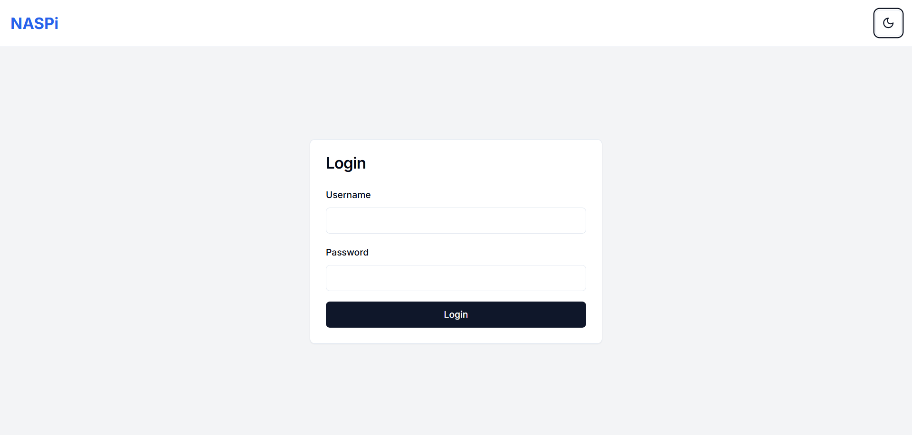

<em>Vista de Login en Web</em>

  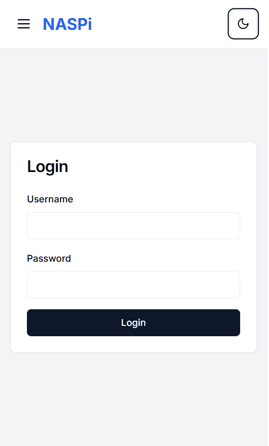
   
  <em>Vista de Login en Móvil</em>

### Dashboard

Una vez dentro, el usuario aparece en la página inicial, conocida como Dashboard, cuya utilización es monitorizar visualmente el estado de la Raspberry Pi 5 (Temperatura, CPU, RAM, etc) así como el almacenamiento total del dispositivo.

En la parte superior, se encuentra una cabecera que nos acompañará toda nuestra estancia en la Web. Esta contiene 3 botones:
- Power OFF / Reiniciar
- Dark / Light Theme
- Logout

Y el logo de "NASPi" a la parte superior izquierda.

A su vez, en la parte izquierda tenemos un menú con el que nos moveremos a lo largo de las demás partes de la web que veremos en las siguientes secciones.

**Nota:** En formato móbil, dicho menú aparece oculto por defecto, siendo que para activarlo habrá que pinchar encima del icono de menu de 3 rayas horizontales communmente conocido como menú hamburguesa.

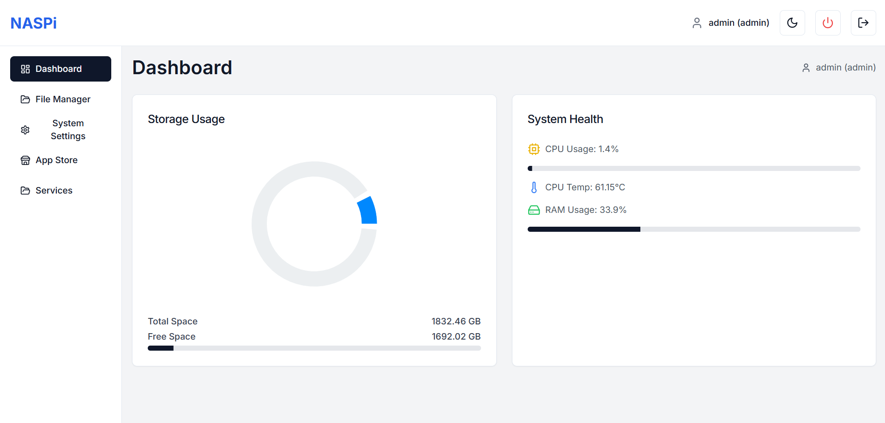

<em>Vista del Dashboard en modo día</em>

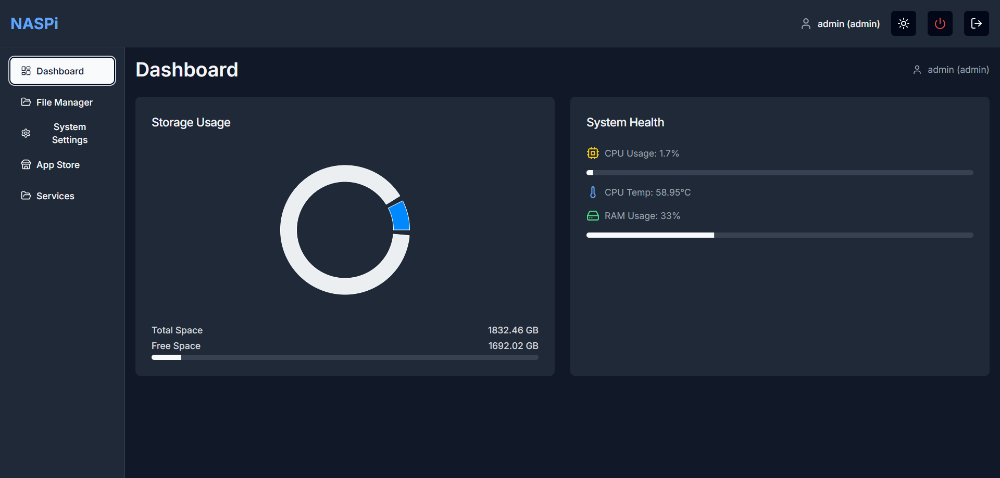

<em>Vista del Dashboard en modo noche</em>

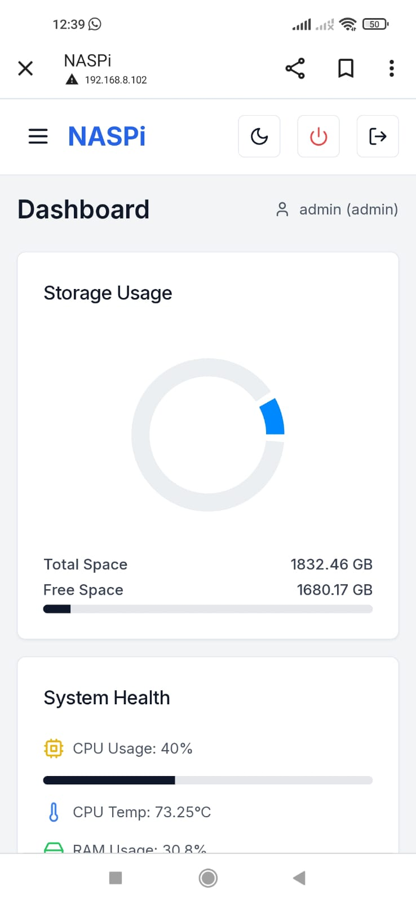

<em>Vista del Dashboard en Móvil</em>

### Gestión de Ficheros

En esta sección de la página, el usuario puede subir, descargar y eliminar archivos así como crear y eliminar carpetas para mejor organización.

Para subir ficheros, basta con hacer click en el botón "Subir Fichero" y seleccionar los ficheros.

La lista de ficheros aceptables para la subida son:

| Tipo de archivo | Extensiones admitidas                     |
|------------------|-------------------------------------------|
| Texto            | `txt`, `pdf`                              |
| Imagen           | `png`, `jpg`, `jpeg`, `gif`               |
| Documento        | `doc`, `docx`                             |
| Hoja de cálculo  | `xls`, `xlsx`                             |
| Presentación     | `ppt`, `pptx`                             |
| Comprimido       | `zip`, `rar`, `7z`, `tar`, `gz`, `tar.gz` |
| Video            | `mp4`, `avi`, `mkv`, `mov`, `wmv`         |

Mientras se suben los ficheros seleccionados, el usuario puede pausar / reanudar la subida o cancelarla con los botónes que acompañan al proceso de subida de ficheros.

En caso de no haber ningún fichero subido, el sistema te avisa con un mensaje de que no hay ningún archivo en el sistema.

De haber seguido correctamente las instrucciones de instalación, la ruta donde se guarden los archivos dentro del raid será: "/mnt/raid/files".

Para terminar, a modo de mejorar la visualización, existen dos botónes en la parte superior que permiten alternar la vista entre ficheros en fila o ficheros en mosaico.

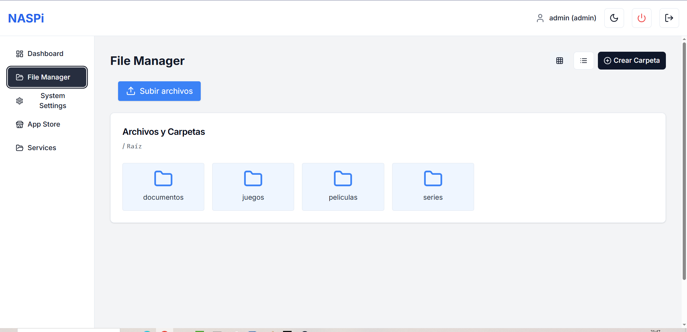

<em>Vista de la Gestión de Ficheros</em>

### Ajustes (Admin)

Esta sección es solo visible para aquel con rol de admin, puesto que involucra monitorizar o editar información importante. Se divide en 3 pestañas.

#### Información Telemática

La primera pestaña nos muestra datos relevantes en el campo de la telemática tales como:
- IP
- Máscara de subred
- Gateway / Puerta de enlace
- Lista de servidores DNS

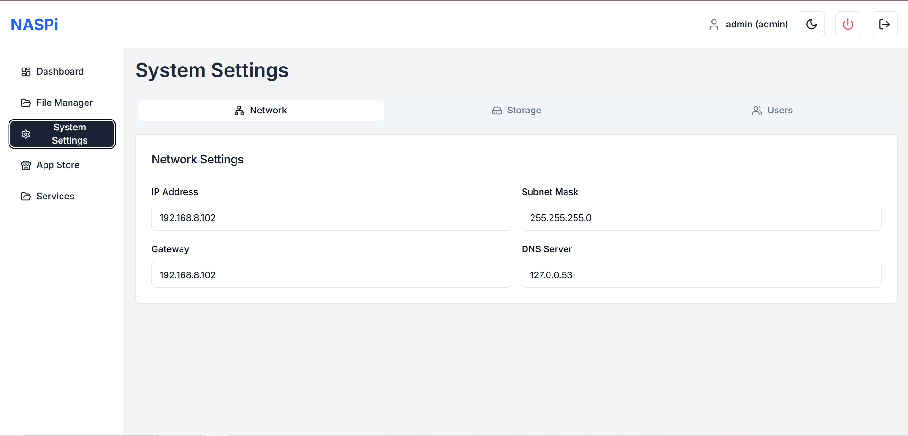

<em>Vista de Ajustes - Sección Network</em>

#### Información SSD & RAID

La segunda pestaña nos muestra información relativa al estado de salud y velocidad de los SSD que conforman la partición RAID del producto NASPi.

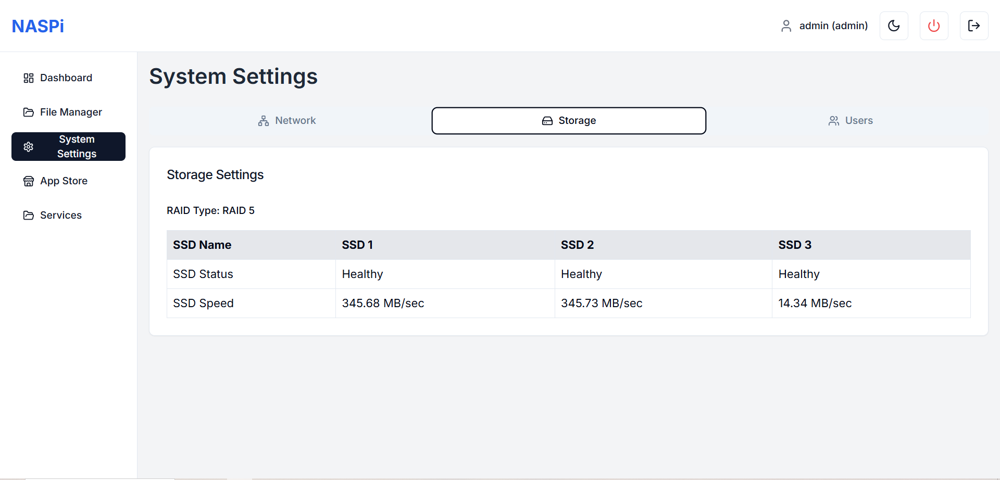

<em>Vista de Ajustes - Sección SSD</em>

#### Gestión de Usuarios

La tercera pestaña es una sección con la cual el administrador puede añadir más usuarios (con los campos User, Password y Rol). El campo de Rol permite seleccionar entre User o Admin. Por defecto, será User para evitar conflictos.

**Nota:** Se recomienda borrar el usuario admin por defecto y crear uno nuevo con una contraseña segura.

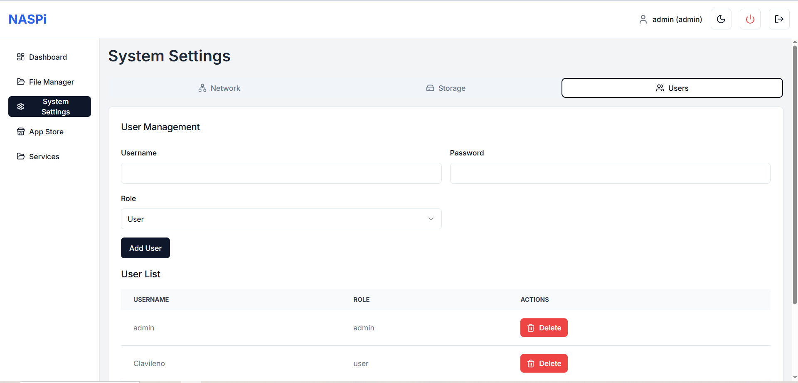

<em>Vista de Ajustes - Sección Gestión de Usuarios</em>

### Tienda (Admin)

En esta sección, el administrador podrá añadir nuevos servicios al producto haciendo click en el botón Instalar de aquel servicio que desee.
La lista de servicios que se pueden instalar está preestablecida siendo únicamente los que se muestran en la siguiente imagen:

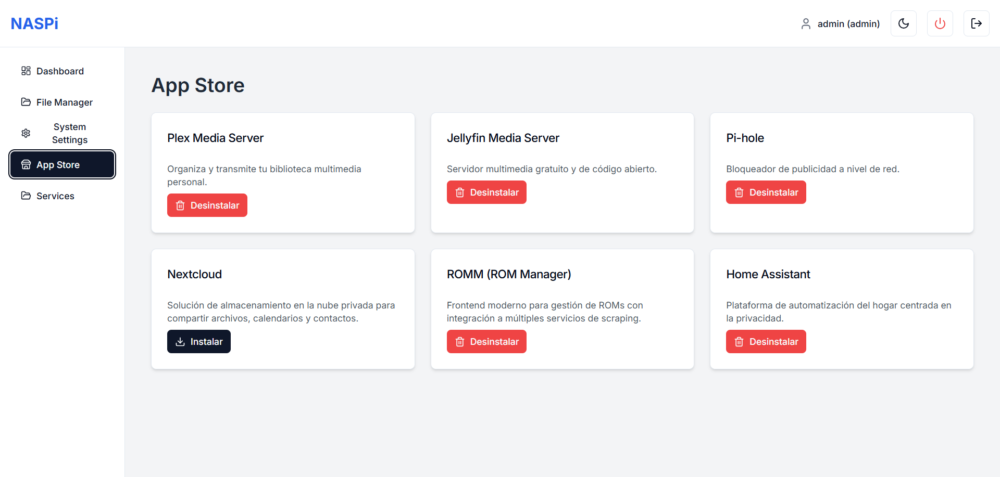

<em>Vista de Tienda</em>

Una vez instalado el servicio, se puede desinstalar si así se quiere puesto que el botón de Instalar será reemplazado con Desinstalar.

**Nota:** Los servicios son contenedores de Docker que pueden ser gestionados mediante Portainer y cuya información relevante se encuentra en "/naspi/backend/data/services.json"
De querer añadir o eliminar más servicios, estos deberán tener su debido formato de Docker Compose adaptado a la estructura del JSON.

### Servicios

En esta seccion, los usuarios podrán acceder mediante un botón "Acceder" a los servicios que previamente un administrador ha instalado en el dispositivo.

En caso de los servicios multimedia (Plex y Jellyfin), se crearán dos carpetas (Pelis y Series) para incluir el contenido de manera más facil. Los directorios serán accesibles y editables desde la pestaña Gestion de Ficheros.

En caso del servicio ROMm, se creará una carpeta Juegos en donde se almacenará cualquier contenido relacionado con el servicio. Sin embargo, la subida de ROMs deberá hacerse por la plataforma oficial a la que se accede con el botón "Acceder" y no por "Gestión de Ficheros".

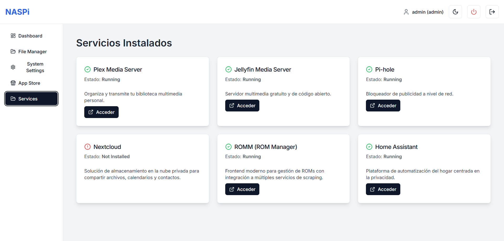

<em>Vista de Servicios</em>
